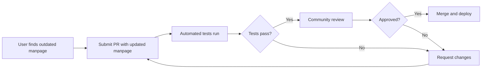

# 📚 Manpages Modernization Plan

## 🎯 Objective

Modernize the manpages system in explainshell to provide up-to-date documentation that reflects current command behavior across multiple Linux distributions and operating systems.

## 📋 Current State Analysis

### ❌ Problems with Current System

1. **Outdated Content**: Manpages haven't been updated in a significant time
2. **Unsustainable Pipeline**: Previous generation system was difficult to maintain
3. **Single Source**: Only contains Ubuntu archive (though comprehensive)
4. **No Live Updates**: Cannot directly add missing manpages to live site
5. **User Confusion**: Users may get explanations that don't match their actual command behavior

### ✅ Current Assets

- **72,349 documents** in MongoDB:
  - 29,763 manpages
  - 42,069 mappings
- Working Python 3.12 compatible system
- Functional web interface
- Active community interest

## 🔄 Proposed Solutions

### Option 1: Multi-Distribution Manpage Aggregation

**Concept**: Aggregate manpages from multiple modern distributions

**Implementation**:

```python
# Manpage sources
DISTRIBUTIONS = {
    'ubuntu': {
        'versions': ['24.04 LTS (Noble)', '22.04 LTS (Jammy)'],
        'priority': 1,
        'base_url': 'http://manpages.ubuntu.com/'
    },
    'debian': {
        'versions': ['12 (Bookworm)', '11 (Bullseye)'],
        'priority': 2,
        'base_url': 'https://manpages.debian.org/'
    },
    'archlinux': {
        'versions': ['rolling'],
        'priority': 3,
        'base_url': 'https://man.archlinux.org/'
    },
    'fedora': {
        'versions': ['39', '40'],
        'priority': 4,
        'base_url': 'https://docs.fedoraproject.org/'
    }
}
```

**Pros**:

- Comprehensive coverage
- Users can select their distribution
- Reflects actual command behavior per distro

**Cons**:

- Storage requirements increase
- Complex deduplication logic needed
- License compliance per distro

### Option 2: Automated Update Pipeline

**Concept**: Create automated system to fetch and parse manpages regularly

**Components**:

1. **Scraper Service**: Automated fetching from distribution repositories
2. **Parser Service**: Convert manpages to explainshell format
3. **Validation Service**: Ensure quality and compatibility
4. **Update Scheduler**: Run weekly/monthly updates

**Technology Stack**:

```yaml
scraper:
  - requests / httpx for HTTP fetching
  - BeautifulSoup / lxml for HTML parsing
  - docker for isolated parsing environments

parser:
  - bashlex for shell syntax parsing
  - man2html for manpage conversion
  - custom regex for explanation extraction

storage:
  - MongoDB for document storage
  - Redis for caching
  - S3/MinIO for raw manpage backup

scheduler:
  - Apache Airflow / Celery
  - GitHub Actions for CI/CD
  - Kubernetes CronJobs
```

**Pros**:

- Always up-to-date
- Minimal manual intervention
- Scalable architecture

**Cons**:

- Infrastructure costs
- Complexity in maintenance
- Risk of breaking changes in sources

### Option 3: Community Contribution System

**Concept**: Allow users to submit and vote on manpage updates

**Features**:

- GitHub-based contribution workflow
- Automated validation and testing
- Community review and approval
- Version control for all manpages

**Workflow**:



**Pros**:

- Low infrastructure cost
- Community-driven quality
- Transparent process

**Cons**:

- Slower updates
- Requires active community
- Inconsistent coverage

### Option 4: Hybrid Approach (Recommended)

**Concept**: Combine automated updates with community contributions

**Phase 1: Foundation (Months 1-2)**

- Set up automated scraper for Ubuntu LTS + Debian Stable
- Create validation pipeline
- Implement storage optimization

**Phase 2: Automation (Months 3-4)**

- Deploy weekly automated updates
- Add monitoring and alerting
- Create diff viewer for changes

**Phase 3: Community (Months 5-6)**

- Open contribution system
- Add voting/rating mechanism
- Implement A/B testing for explanations

**Phase 4: Expansion (Months 7+)**

- Add more distributions
- Support for macOS commands
- Windows WSL integration

## 🛠️ Technical Implementation

### Database Schema Enhancement

```javascript
// Enhanced manpage document
{
  _id: ObjectId,
  command: "ls",
  section: 1,
  distribution: "ubuntu",
  version: "24.04",
  last_updated: ISODate,
  source_url: "http://manpages.ubuntu.com/...",
  hash: "sha256...",
  content: {
    name: "ls - list directory contents",
    synopsis: "ls [OPTION]... [FILE]...",
    description: "...",
    options: [
      {
        flag: "-l",
        description: "use a long listing format",
        examples: ["ls -l /home"]
      }
    ]
  },
  metadata: {
    popularity_score: 95,
    accuracy_rating: 4.8,
    last_verified: ISODate,
    community_votes: 142
  }
}
```

### API Enhancement

```python
# New API endpoints
@app.route('/api/v2/explain')
def explain_v2():
    """
    Enhanced explain endpoint with distribution support

    Query params:
    - cmd: command to explain
    - distro: target distribution (ubuntu|debian|arch|fedora)
    - version: distribution version
    """
    pass

@app.route('/api/v2/manpages/<command>')
def get_manpage_versions():
    """Get all available versions of a manpage"""
    pass

@app.route('/api/v2/contribute')
def contribute_manpage():
    """Submit a manpage update"""
    pass
```

### Scraper Architecture

```python
# scripts/manpage_scraper.py
import asyncio
import aiohttp
from typing import List, Dict
from dataclasses import dataclass

@dataclass
class ManpageSource:
    distro: str
    version: str
    url: str
    parser_type: str

class ManpageScraper:
    async def fetch_manpage_list(self, source: ManpageSource) -> List[str]:
        """Fetch list of available manpages from source"""
        pass

    async def download_manpage(self, command: str, source: ManpageSource) -> str:
        """Download raw manpage content"""
        pass

    async def parse_manpage(self, content: str, parser_type: str) -> Dict:
        """Parse manpage into structured format"""
        pass

    async def validate_manpage(self, parsed: Dict) -> bool:
        """Validate parsed manpage meets quality standards"""
        pass

    async def store_manpage(self, parsed: Dict) -> None:
        """Store in MongoDB"""
        pass
```

## 📊 Success Metrics

### Quantitative Metrics

- **Coverage**: % of top 1000 commands with up-to-date manpages
- **Freshness**: Average age of manpages < 90 days
- **Accuracy**: User rating > 4.5/5
- **Availability**: 99.9% uptime for manpage API

### Qualitative Metrics

- User satisfaction surveys
- Community contribution rate
- Issue resolution time
- Documentation completeness

## 🚀 Getting Started

### Prerequisites

```bash
# Install dependencies
pip install -r requirements-manpages.txt

# Set up configuration
cp config/manpages.example.yml config/manpages.yml
# Edit config/manpages.yml with your settings
```

### Running the Scraper

```bash
# Fetch manpages from Ubuntu Noble
python scripts/manpage_scraper.py --distro ubuntu --version 24.04

# Update specific commands
python scripts/manpage_scraper.py --commands ls,grep,find,tar

# Full update (use with caution)
python scripts/manpage_scraper.py --full-update
```

### Testing

```bash
# Run manpage parser tests
pytest tests/test_manpage_parser.py

# Validate manpage quality
python scripts/validate_manpages.py --sample 100

# Compare with current database
python scripts/diff_manpages.py --command ls
```

## 🤝 Contributing

We welcome contributions to improve the manpage system!

### How to Contribute

1. **Report Outdated Manpages**
   - Open an issue with the command name
   - Provide the correct/current behavior
   - Include your OS/distribution

2. **Submit Updated Manpages**
   - Fork the repository
   - Add manpage to `data/manpages/<distro>/<command>.1`
   - Run validation: `make validate-manpage`
   - Submit PR with description

3. **Improve the Pipeline**
   - Enhance scraper efficiency
   - Add new distribution support
   - Improve parsing accuracy

### Contribution Guidelines

See [CONTRIBUTING.md](./CONTRIBUTING.md) for detailed guidelines.

## 📅 Roadmap

### Q4 2025

- ✅ Document current state and problems
- ✅ Design modernization architecture
- 🔄 Implement basic scraper for Ubuntu
- ⏳ Set up CI/CD for automated updates

### Q1 2026

- ⏳ Deploy automated weekly updates
- ⏳ Add Debian and Arch Linux support
- ⏳ Implement distribution selector in UI
- ⏳ Launch beta testing program

### Q2 2026

- ⏳ Open community contribution system
- ⏳ Add manpage versioning and history
- ⏳ Implement A/B testing for explanations
- ⏳ Performance optimization

### Q3 2026

- ⏳ Add macOS command support
- ⏳ Integrate Windows WSL commands
- ⏳ Launch public API v2
- ⏳ Comprehensive documentation

## 📚 Resources

### Manpage Sources

- [Ubuntu Manpages](http://manpages.ubuntu.com/)
- [Debian Manpages](https://manpages.debian.org/)
- [Arch Linux Man Pages](https://man.archlinux.org/)
- [man7.org](https://man7.org/linux/man-pages/)

### Tools and Libraries

- [man2html](https://github.com/michaelmacinnis/man2html)
- [pandoc](https://pandoc.org/) - Universal document converter
- [groff](https://www.gnu.org/software/groff/) - GNU troff text formatter

### Related Projects

- [tldr-pages](https://github.com/tldr-pages/tldr) - Simplified manpages
- [cheat.sh](https://cheat.sh/) - Community-driven cheatsheets
- [explainshell.com](https://explainshell.com/) - Original inspiration

## 💬 Discussion

Join the discussion on GitHub:

- [Issue #XXX: Manpages Modernization](https://github.com/tobiashochguertel/explainshell/issues/XXX)
- [Discussions](https://github.com/tobiashochguertel/explainshell/discussions)

---

**Last Updated**: October 26, 2025
**Status**: Planning Phase
**Maintainer**: [@tobiashochguertel](https://github.com/tobiashochguertel)
